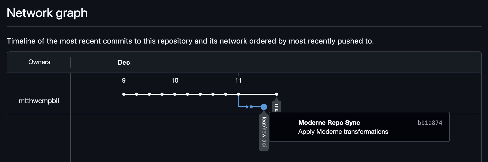
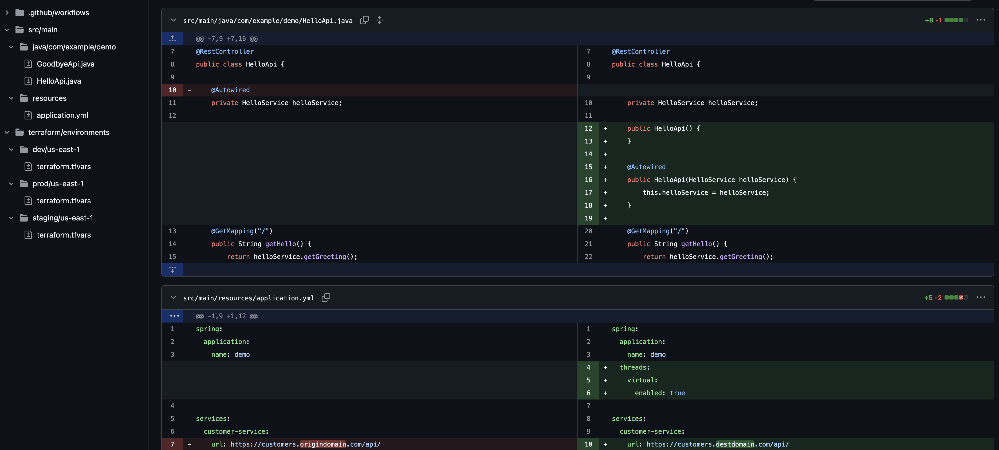

# Moderne Repository Sync Action

This action provides an automated way to synchronize a GitHub repository to a destination repository while applying code transformations using the Moderne CLI. It ensures the destination repository's history mirrors the origin's, with specific code modifications applied on top.

## How It Works

The sync process follows these steps:
1.  **Clone**: Clones the source (origin) repository.
1.  **LFS**: Pulls Git LFS objects if applicable.

For each branch in the origin repo, this action does the following:

1.  **Global Sanitization**: Applies configured Moderne recipes (OpenRewrite) to the codebase.
1.  **Repository-Specific Sanitization**: Applies additional configured recipes that this repository wants to apply.
1.  **Commit**: Creates a single new squashed commit with all applied transformations.
1.  **Force Push**: Pushes the entire history to the destination repository, overwriting it to match the origin + transformations.

## Recipe Configuration

The action supports two levels of recipe configuration, allowing for both global standards and repository-specific needs.

### 1. Global Recipes
Global recipes are defined in the sync workflow (`run-sync.yml`) or passed via the `global_recipes` input. These transformations are applied to **every** repository that uses this sync action.

**Use Case**:
-   Swapping internal domain names for external ones (e.g., `origindomain.com` -> `destdomain.com`) using the [FindAndReplace](https://docs.openrewrite.org/recipes/text/findandreplace) recipe.
-   Standardizing infrastructure configuration (e.g., AWS regions) using the [Terraform/HCL FindAndReplaceLiteral](https://docs.openrewrite.org/recipes/hcl/findandreplaceliteral) recipe.

### 2. Repository-Specific Recipes
Additional recipes can be specified by the origin repository when triggering the sync. these are passed in the `client_payload` of the `repository_dispatch` event.

**Use Case**:
-   Applying unit test best practices (JUnit 5, AssertJ) specific to a Java project.
-   Running static analysis fixes relevant to the specific codebase.

## Usage

### Triggering a Sync
The sync is typically triggered automatically by a workflow in the origin repository:

```yaml
name: Trigger Sync

on:
  workflow_dispatch:
  push:
    branches:
      - '**'
    tags:
      - '**'

jobs:
  trigger:
    runs-on: ubuntu-latest
    steps:
      - name: Trigger Sync Workflow
        uses: peter-evans/repository-dispatch@v2
        with:
          token: ${{ secrets.GH_PAT }}
          repository: mtthwcmpbll/moderne-repo-sync-example
          event-type: sync-trigger
          client-payload: |
            {
              "origin_repo": "git@github.com:mtthwcmpbll/moderne-repo-sync-origin.git",
              "destination_repo": "git@github.com:mtthwcmpbll/moderne-repo-sync-destination.git",
              "recipes": [
                "io.moderne.java.spring.boot3.SpringBoot3BestPractices",
                "org.openrewrite.staticanalysis.CommonStaticAnalysis"
              ]
            }
```

## Verification

The goal for this example is to ensure that:

- The entire history of the origin repository is mirrored in the destination repository, with the additional transformations applied.
- The additional transformations are maintained as a single commit so we're not littering the history with transformation commits.
- We can support a set of global standard transformations that are always applied.
- We can support a set of repository-specific transformations to support additional needed changes for a specific repository or tech stack.

This repository is currently syncing the [moderne-repo-sync-origin](https://github.com/mtthwcmpbll/moderne-repo-sync-origin) repository to the [moderne-repo-sync-destination](https://github.com/mtthwcmpbll/moderne-repo-sync-destination) repository as an example.  You can view the full git history of both repositories to compare the results.  Here's the destination repository's history, where we can see each branch ends with a single transformation commit:



If we look at the transformation commit a the end of one of the branches, we'll see changes from the repository-specific recipes (Spring Boot best practices to move field injected dependencies to constructor injected dependencies) and the global recipes (swapping internal domain names for external ones):



